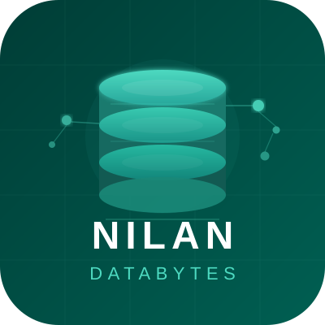

# Nilan DataBytes Website Content Guide

Verified against repository commit `ca267cc` on 5 September 2026. Line numbers below refer to that exact revision; adding or removing lines will shift later references. The website source was not changed while preparing this guide.

## How to use this guide

- **Safe wording edit — Yes:** text can normally be changed without affecting behavior, provided the HTML structure, attributes, IDs and classes remain intact.
- **Conditional:** wording is safe, but length, factual substantiation, accessibility, metadata consistency or a related JavaScript lookup requires care.
- **No:** the value is also a key, selector, URL, form value or programmatic control. Change it only together with the dependent code.
- Line ranges identify the complete element or data structure. A searchable phrase is supplied when that is more durable than a line number.
- Technology marks are CSS background images. Their fallback letters are hidden visually by `.tech-mark { color: transparent; }` and the elements are made decorative by JavaScript.

## Repository-wide content sources

| Source | Purpose | Content implications |
|---|---|---|
| `index.html` | Homepage, contact form, Operations Center and AI Brief shell | Most marketing content and all interactive UI containers |
| `services.html` | Detailed services page | Service descriptions, chips and delivery process |
| `training.html` | Training page | Learning paths, trainer content and mail links |
| `about.html` | Company/team page | Team biographies, images, testimonial and external founder profile |
| `case-studies.html` | Outcomes page | Three case-study narratives and metrics |
| `404.html` | Not-found page | Error message and return link |
| `site.js` | Shared interactions | Dynamic menu labels, current year, Operations Center telemetry, form technology options and all tailored AI Brief answers |
| `site.css` | Shared presentation | Technology-logo asset mapping and pseudo-content; no substantive prose |
| `logo.svg` | Site logo/favicon | Used in every page header/footer and as structured-data logo |

## Shared header and navigation

The same header is repeated rather than templated. A wording change must therefore be applied to every page listed below.

| Exact displayed content | Locations | Selector / phrase | Destination or asset | Safe? | Notes |
|---|---|---|---|---|---|
| Nilan DataBytes | `index.html:36`; `services.html:28`; `training.html:28`; `about.html:28`; `case-studies.html:28` | `.site-header .brand strong` | `index.html` | Yes, conditional | Keep the visible name aligned with metadata, JSON-LD and logo branding. |
| Database Engineering • Reliability • Cloud | `index.html:37`; `services.html:29`; `training.html:29`; `about.html:29`; `case-studies.html:29` | `.site-header .brand small` | — | Yes | On narrow screens this secondary line may wrap or be hidden by CSS. |
| Home / Services / Training / About / Case Studies | `index.html:41-44`; `services.html:33-36`; `training.html:33-36`; `about.html:33-36`; `case-studies.html:33-35` | `#main-navigation` | Corresponding `.html` pages | Conditional | Changing labels is safe; do not change `href`, active class, ID or `aria-label` without retesting navigation. |
| Discuss a Project | `index.html:46-48`; `services.html:38`; `about.html:38`; `case-studies.html:37` | `.nav-cta` | Homepage `#contact` | Yes | Keep concise for desktop and mobile header fit. |
| Explore Training | `training.html:38-41` | `.nav-cta` | `mailto:contact@nilandatabytes.com?subject=Training%20Enquiry` | Conditional | If the visible wording changes, the email subject may also need updating. |
| Open menu / Close menu | `site.js:7`, `site.js:14`; initial HTML at `index.html:49`, `services.html:39`, `training.html:42`, `about.html:39`, `case-studies.html:38` | `.menu[aria-label]` | — | Conditional | Accessibility-only labels; keep action-oriented and synchronized with open/closed state. |
| ☰ | Same HTML lines as menu above | `button.menu` | — | Yes | Visual symbol; the accessible name comes from `aria-label`. |

```html
<a class="brand" href="index.html">
  <span><strong>Nilan DataBytes</strong><small>Database Engineering • Reliability • Cloud</small></span>
</a>
<nav class="main-nav" id="main-navigation" aria-label="Main navigation">…</nav>
```

Header logo: HTML locations are `index.html:34-38`, `services.html:26-30`, `training.html:26-30`, `about.html:26-30`, and `case-studies.html:26-30`; local asset `logo.svg`. The non-empty header `alt` text identifies the brand. Footer copies use empty `alt` because the adjacent text already names the company.

## Shared footer

| Exact displayed content | Locations | Selector / phrase | Destination | Safe? | Notes |
|---|---|---|---|---|---|
| Nilan DataBytes | `index.html:936`; `services.html:211`; `training.html:153`; `about.html:167`; `case-studies.html:178` | `.footer .brand strong` | `index.html` | Yes, conditional | Repeated in five files. |
| Reliable data systems, built hands-on. | `index.html:937` only | `.footer .brand small` | — | Yes | Homepage-only footer strapline. |
| Expertise; Services; Training | `index.html:942-944`; `services.html:216-218`; `training.html:158-160`; `about.html:172-174`; `case-studies.html:183-185` | `.footer h4`, link text | `services.html`, `training.html` | Yes | Keep headings short. |
| Company; About & Team; Case Studies | `index.html:947-949`; `services.html:221-223`; `training.html:163-165`; `about.html:177-179`; `case-studies.html:188-190` | Search `About & Team` | `about.html`, `case-studies.html` | Yes | Repeated. |
| Contact; Email us; LinkedIn | `index.html:952-954` | `.footer` contact column | Email and `https://www.linkedin.com/company/113022948` | Conditional | Link destination is not wording. LinkedIn URL differs from JSON-LD `sameAs`; reconcile deliberately. |
| Contact; Discuss a Project | `services.html:226-227`; `about.html:182-183`; `case-studies.html:193-194` | Footer contact column | `index.html#contact` | Yes | — |
| Contact; Email us | `training.html:168-169` | Footer contact column | `mailto:contact@nilandatabytes.com` | Yes | — |
| © [current year] Nilan DataBytes. All rights reserved. | `index.html:958` | `[data-year]` | Year inserted by `site.js:25-27` | Conditional | Do not remove `data-year`; other pages omit “All rights reserved.” |
| © [current year] Nilan DataBytes. | `services.html:231`; `training.html:173`; `about.html:187`; `case-studies.html:198` | `[data-year]` | Year inserted by JavaScript | Conditional | Keep the empty year span. |

```js
document.querySelectorAll("[data-year]").forEach((el) =>
  (el.textContent = new Date().getFullYear())
);
```

# Homepage — `index.html`

## Metadata and non-visible identity

| Exact content | Source | Selector / phrase | Asset/link | Safe? | Considerations |
|---|---|---|---|---|---|
| Nilan DataBytes \| Database Engineering & Cloud Migration | `index.html:6`, `15`, `22` | `<title>`, `og:title`, `twitter:title` | — | Conditional | Keep title and social title consistent; target a concise search-result title. |
| Database engineering, ETL, performance audits, managed DBA and cloud migration for mission-critical systems. | `index.html:7-10`, `16` | `meta[name=description]`, `og:description` | — | Conditional | Search/social copy; changing one should normally change both. |
| Engineering and operating dependable database and data-platform systems. | `index.html:23` | `twitter:description` | — | Conditional | Intentionally shorter than the main description. |
| https://nilandatabytes.com/ | `index.html:11`, `17`, `26` | canonical, `og:url`, JSON-LD `url` | Production homepage | No | URL, not wording. Update only if the canonical domain changes. |
| Social preview | `index.html:18-24` | `og:image`, `twitter:image` | `assets/social-preview.png` via absolute production URL | No | Image should remain 1200×630 as declared at lines 19-20. |
| ProfessionalService structured data | `index.html:25-27` | `script[type="application/ld+json"]` | Logo, email, phone, LinkedIn | Conditional | Visitor-invisible but search-facing. Validate JSON after edits; claims must match visible content. |
| Theme color #071522 | `index.html:12` | `meta[name=theme-color]` | — | No | Styling value, not prose. |

```html
<title>Nilan DataBytes | Database Engineering &amp; Cloud Migration</title>
<meta name="description" content="Database engineering, ETL, performance audits, managed DBA and cloud migration for mission-critical systems." />
<meta property="og:image" content="https://nilandatabytes.com/assets/social-preview.png" />
```

## Hero

| Exact displayed content | Source | Selector / phrase | Destination | Safe? | Considerations |
|---|---|---|---|---|---|
| Database engineering · for critical systems | `index.html:59` | `.hero .eyebrow` | — | Yes | Uppercase through CSS; keep compact. |
| Database systems built to perform. Built to last. | `index.html:60-63` | `.hero h1`, `.gradient` | — | Yes, conditional | Main H1; length strongly affects hero balance. Preserve the gradient span if only changing wording. |
| Architecture, SQL and ETL development, performance tuning, monitoring and cloud migration for business-critical databases. | `index.html:64-67` | `.hero-copy .lead` | — | Yes | Aim for two to three desktop lines. |
| SQL Server; Oracle; PostgreSQL; MySQL; Cassandra; MongoDB; Firebase | `index.html:68-89` | `.hero-platforms .hero-platform` | CSS logo assets (see logo map) | Conditional | Visible names may be hidden by responsive CSS. `aria-label` must continue to identify logo-only tiles. |
| ETL & Migration | `index.html:90-98` | `.etl-pathway`, searchable phrase | `#technologies`, opens ETL tab | Conditional | Keep `data-open-tech="etl"`; changing the key breaks tab targeting. |
| Reporting & Analytics | `index.html:99-107` | `.reporting-pathway` | `#technologies`, opens reporting tab | Conditional | Keep `data-open-tech="reporting"`. |
| View all technologies ↓ | `index.html:109-110` | `.view-tech-link` | `#technologies` | Yes | Arrow is decorative but contributes visually. |
| Schedule a Database Audit → | `index.html:113-114` | `.hero-primary` | `#contact` | Yes | Primary CTA; keep concise. |
| Get the 30-second overview ✦ | `index.html:115-122` | `.ai-brief-trigger` | Opens `#nilanAiDrawer` | Conditional | Do not remove trigger class, `aria-haspopup` or `aria-controls`. If “30-second” changes, align expectation with animation/content length. |
| Available for database audits and migration planning | `index.html:124-127` | `.hero-trust` | — | Conditional | Availability claim should remain operationally accurate. |

```html
<p class="eyebrow">Database engineering · for critical systems</p>
<h1>Database systems <span class="gradient">built to perform. Built to last.</span></h1>
<button class="btn secondary hero-secondary ai-brief-trigger" aria-controls="nilanAiDrawer">
  Get the 30-second overview <span aria-hidden="true">✦</span>
</button>
```

## Database Operations Center

The left buttons contain visible labels and the `data-*` response copied into the right dashboard by `site.js:85-99`. Editing display wording is safe; editing capability keys is not.

| Capability / exact text | HTML lines | Dynamic source | Stable selector | Safe? | Considerations |
|---|---|---|---|---|---|
| DATABASE OPERATIONS CENTER; ALL SYSTEMS OPERATIONAL | `index.html:134-139` | — | `.ops-topbar`, `.ops-live` | Conditional | “Operational” can look like live telemetry; retain only if clearly demonstrative and accurate. |
| Monitoring / Health & alerts | `index.html:146-156` | Title “Always-on database care”; description “We monitor health, availability and workload signals before small issues become incidents.”; KPI “99.99%”; “availability target” at `149-152` | `[data-capability="monitoring"]` | Conditional | Do not change capability key. KPI is a claim and must be substantiated/contextualized. |
| Architecture / Design & resilience | `index.html:157-169` | “Architecture built to scale”; “We design schemas, data flows, resilience and capacity around how your business actually operates.”; “Scale”; “without redesign” at `160-163` | `[data-capability="architecture"]` | Conditional | Keep labels compact enough for the dashboard card. |
| Development / SQL & ETL | `index.html:170-180` | “Development that stays maintainable”; “From stored procedures to ETL pipelines, we build clean database solutions your team can support.”; “Clean”; “production delivery” at `173-176` | `[data-capability="development"]` | Conditional | — |
| Optimization / Tuning & performance | `index.html:181-194` | “Faster queries, lower cost”; “Execution-plan analysis, indexing and workload tuning turn slow systems into responsive platforms.”; “60%”; “latency reduction achieved” at `184-187` | `[data-capability="optimization"]` | Conditional | Metric should match the featured engagement language elsewhere. |
| Administration / DBA operations | `index.html:195-207` | “Confident day-to-day administration”; “Backups, recovery, patching, security and routine maintenance are handled with clear accountability.”; “24/7”; “support options” at `198-201` | `[data-capability="administration"]` | Conditional | Availability and service-scope claims need confirmation. |
| Cloud & Training / Modernize & enable | `index.html:208-221` | “Modernize without migration drama”; “We plan cloud moves, validate cutovers and right-size infrastructure across Azure, AWS and GCP.”; “50+”; “migrations delivered” at `211-214` | `[data-capability="cloud"]` | Conditional | The capability key `cloud` also switches the bottom row to training technologies. |
| YOUR DATABASE, UNDER CONTROL; PRODUCTION | `index.html:224-230` | — | `.dashboard-heading`, `.environment` | Yes | Decorative interface copy. |
| WORKLOAD RESPONSE; LIVE | `index.html:235-239` | — | `.chart-label` | Conditional | “LIVE” is simulated interface copy, not live customer data. |
| 99.99%; availability target | `index.html:272-275` | Updated during boot at `site.js:184`, `198-203` | `#opsKpi`, `#opsKpiLabel` | Conditional | The percentage animates from 0.00%; change HTML and animation target together. |
| Query latency / 42 ms / ↓ 18% optimized | `index.html:278-284` | Boot sequence `site.js:185-186`, `205-215`, `238-242`; profile `site.js:54` | `#metricOneLabel`, `#latencyValue`, `#latencyChange` | Conditional | Demonstration values. If edited, update HTML, telemetry profile and boot final state. |
| Database health / Stable / ✓ Checks passed | `index.html:285-291` | Boot states and resolution at `site.js:187-188`, `232-236`; profile `site.js:55` | `#metricTwoLabel`, `#healthValue`, `#healthChange` | Conditional | JavaScript temporarily shows “Assessing…” and “● analyzing signals”. |
| Active alerts / 0 / ● Healthy | `index.html:292-297` | Boot states `site.js:189-190`, `217-230`; profile `site.js:56` | `#metricThreeLabel`, `#alertsValue`, `#alertsChange` | Conditional | Animates 3 → 2 → 1 → 0. |
| Protection running; Monitoring · performance · resilience · cloud readiness; NOW | `index.html:298-305`, `318` | Restored by `site.js:138-143` | `#activityTitle`, `#activityDetail`, `#activityTime` | Conditional | Cloud tab replaces this with the training list and “HANDS-ON”. |
| Technologies we train; SQL Server, PostgreSQL, MySQL, SSIS, ADF, Azure, GCP, Databricks | `index.html:307-317` | Visibility toggled by `site.js:133-138` | `#trainingTechList` | Yes | Hidden except for Cloud & Training. Keep list aligned with the training page/form. |

Dynamic telemetry profile strings, all in `site.js:52-83`:

```js
monitoring: [["Query latency", "42 ms", "↓ 18% optimized"], ["Database health", "Stable", "✓ Checks passed"], ["Active alerts", "0", "● Healthy"]],
architecture: [["Data model", "Scalable", "✓ Workload aligned"], ["Capacity plan", "Defined", "✓ Growth ready"], ["Resilience", "Designed", "✓ Failure aware"]],
development: [["SQL quality", "Reviewed", "✓ Maintainable patterns"], ["Pipeline checks", "Passed", "✓ Validation enabled"], ["Delivery state", "Ready", "● Production prepared"]],
optimization: [["Baseline latency", "10.0 s", "● Before tuning"], ["Optimized latency", "4.0 s", "↓ Featured engagement"], ["Improvement", "Up to 60%", "✓ Highest-impact first"]],
administration: [["Maintenance plan", "Active", "✓ Scheduled controls"], ["Access review", "Current", "✓ Least privilege"], ["Coverage", "24/7", "● Options available"]],
cloud: [["Migration plan", "Ready", "✓ Rollback included"], ["Platform fit", "Cloud-ready", "✓ Right-sized design"], ["Team enablement", "Practical", "✓ Knowledge transferred"]]
```

Boot-only strings are at `site.js:184-190`, `201`, `209-213`, `219-235`, and `240-241`: `0.00%`, `10.0 s`, `▲ baseline latency`, `Assessing…`, `● analyzing signals`, `3`, `● Attention needed`, the animated availability/latency/percentage values, `2`, `● Resolving signals`, `1`, `0`, `● Healthy`, `Stable`, `✓ Checks passed`, `42 ms`, `↓ 18% optimized`. These are **not safe as isolated wording edits** because the timed code and final HTML/profile states must remain synchronized. Motion is disabled when `prefers-reduced-motion` is active (`site.js:123-125`, `180-182`).

## Proof metrics

| Exact content | Source | Selector | Safe? | Considerations |
|---|---|---|---|---|
| 16+ years of database expertise | `index.html:327-329` | `.proof-item` | Conditional | Verify experience basis. AI Brief says “experience,” not “expertise.” |
| 50+ successful migrations | `index.html:330-332` | `.proof-item` | Conditional | AI Brief says “completed migrations”; choose one verified formulation. |
| 60% query latency reduction achieved | `index.html:333-335` | `.proof-item` | Conditional | AI Brief correctly adds “Up to” and featured-engagement context; consider aligning this wording. |
| 24/7 support options available | `index.html:336-338` | `.proof-item` | Conditional | “Options available” is safer than implying every engagement includes 24/7 coverage. |

## Technology ecosystem

Intro content is at `index.html:341-350`: **Technology ecosystem**, **Engineering across your data stack**, and “From operational databases to integration pipelines, reporting and cloud platforms, we help teams design, improve and operate the systems behind their data.” Wording-only edits are safe; the H2 should remain concise.

Tab labels are **Databases**, **ETL & Integration**, **Reporting & BI**, and **Cloud Data** at `index.html:358-396`. Their stable IDs are `#tab-databases`, `#tab-etl`, `#tab-reporting`, `#tab-cloud`; panels are `#panel-databases`, `#panel-etl`, `#panel-reporting`, `#panel-cloud`. Labels are safe to edit, but IDs, `aria-controls`, `aria-labelledby`, and `data-tech-tab`/`data-tech-panel` keys are not. Keyboard behavior is implemented at `site.js:261-301`.

| Category | Exact card content | HTML lines | CSS logo class | Safe? |
|---|---|---|---|---|
| Databases | SQL Server — Enterprise database | `index.html:405-408` | `.tech-mark.ms` | Yes, conditional |
| Databases | Azure SQL — Managed cloud database | `index.html:409-412` | `.tech-mark.az` | Yes, conditional |
| Databases | Oracle Database — Enterprise database | `index.html:413-418` | `.tech-mark.oracle` | Yes |
| Databases | PostgreSQL — Open-source database | `index.html:419-422` | `.tech-mark.pg` | Yes |
| Databases | MySQL — Application database | `index.html:423-426` | `.tech-mark.my` | Yes |
| Databases | Firebird — Relational database | `index.html:427-430` | `.tech-mark.firebird` | Yes |
| Databases | MongoDB — Document database | `index.html:431-434` | `.tech-mark.mongo` | Yes |
| Databases | Apache Cassandra — Distributed database | `index.html:435-440` | `.tech-mark.cassandra` | Yes |
| Databases | DataStax Cassandra — Managed Cassandra platform | `index.html:441-447` | `.tech-mark.datastax` | Yes |
| Databases | Firebase — Realtime app database | `index.html:448-451` | `.tech-mark.firebase` | Yes |
| ETL | SSIS — Data integration | `index.html:461-464` | `.tech-mark.ssis` | Yes, conditional |
| ETL | Azure Data Factory — Cloud orchestration | `index.html:465-470` | `.tech-mark.adf` | Yes |
| ETL | Talend — Integration platform | `index.html:471-474` | `.tech-mark.talend` | Yes |
| ETL | Databricks — Lakehouse engineering | `index.html:475-478` | `.tech-mark.bricks` | Yes |
| ETL | Python — Data engineering | `index.html:479-482` | `.tech-mark.python` | Yes |
| Reporting | SSRS — Operational reporting | `index.html:492-495` | `.tech-mark.ssrs` | Yes, conditional |
| Reporting | Power BI — Business intelligence | `index.html:496-499` | `.tech-mark.pbi` | Yes |
| Reporting | Paginated Reports — Pixel-perfect reporting | `index.html:500-505` | `.tech-mark.pbi` | Yes |
| Cloud | Azure SQL MI — Managed instance | `index.html:515-518` | `.tech-mark.az` | Yes |
| Cloud | Azure Synapse — Analytics platform | `index.html:519-522` | `.tech-mark.syn` | Yes |
| Cloud | Azure Databricks — Cloud lakehouse | `index.html:523-526` | `.tech-mark.bricks` | Yes |
| Cloud | Amazon Web Services — Cloud data services | `index.html:527-532` | `.tech-mark.aws` | Yes |
| Cloud | Google Cloud Platform — Cloud data services | `index.html:533-538` | `.tech-mark.gcp` | Yes |
| Cloud | BigQuery — Cloud data warehouse | `index.html:539-542` | `.tech-mark.bq` | Yes |
| Cloud | Snowflake — Cloud data platform | `index.html:543-546` | `.tech-mark.snowflake` | Yes |

```html
<article class="technology-card">
  <i class="tech-mark pg">PG</i>
  <div><b>PostgreSQL</b><small>Open-source database</small></div>
</article>
```

### Technology logo asset map

All HTML logo elements above and hero marks use the matching class. Base sizing/presentation is `site.css:905-924` (36×36 px, white container, centered non-repeating image at 68%). JavaScript makes all `.tech-mark` elements `aria-hidden="true"` at `site.js:29-31`, so adjacent text or parent `aria-label` must remain available.

| Classes | CSS lines | Local asset |
|---|---|---|
| `.ms`, `.ssis`, `.ssrs` | `site.css:925-929` | `assets/technologies/sql-server.svg` |
| `.pg` | `site.css:930-932` | `assets/technologies/postgresql.svg` |
| `.my` | `site.css:933-935` | `assets/technologies/mysql.svg` |
| `.az`, `.adf`, `.syn` | `site.css:936-940` | `assets/technologies/azure.svg` |
| `.mongo` | `site.css:941-943` | `assets/technologies/mongodb.svg` |
| `.oracle` | `site.css:944-946` | `assets/technologies/oracle.svg` |
| `.firebird` | `site.css:947-949` | `assets/technologies/firebird.svg` |
| `.python` | `site.css:950-952` | `assets/technologies/python.svg` |
| `.snowflake` | `site.css:953-955` | `assets/technologies/snowflake.svg` |
| `.cassandra` | `site.css:956-958` | `assets/technologies/cassandra.svg` |
| `.datastax` | `site.css:959-961` | `assets/technologies/datastax.svg` |
| `.firebase` | `site.css:962-964` | `assets/technologies/firebase.svg` |
| `.talend` | `site.css:965-967` | `assets/technologies/talend.svg` |
| `.bricks` | `site.css:968-970` | `assets/technologies/databricks.svg` |
| `.pbi` | `site.css:971-974` | `assets/technologies/powerbi.svg` |
| `.aws` | `site.css:975-977` | `assets/technologies/aws.svg` |
| `.gcp` | `site.css:978-980` | `assets/technologies/google-cloud.svg` |
| `.bq` | `site.css:981-983` | `assets/technologies/bigquery.svg` |

Changing a logo requires replacing the local asset or changing the relevant `background-image`; this is **not** a wording-only edit. Note that SSIS and SSRS intentionally reuse the SQL Server mark, and Azure SQL/ADF/Synapse share the Azure mark.

## Core services, clients, cases and training CTA

| Section | Exact content | Source | Selector / asset / destination | Safe? / notes |
|---|---|---|---|---|
| Core services intro | Core services; Focused expertise across the database lifecycle; “From a single performance bottleneck to an end-to-end modernization program, every engagement starts with a clear technical outcome.” | `index.html:551-560` | `#services .section-head` | Yes |
| Service card | Database Engineering — “Architecture, development and optimization for scalable, maintainable systems.” | `index.html:563-570` | `#services .card`; icon `DB` | Yes |
| Service card | Performance Audits — “Find slow queries, indexing gaps and capacity risks with an actionable plan.” | `index.html:571-578` | icon `↗` | Yes |
| Service card | ETL Architecture — “Design resilient pipelines with validation, observability and reliable delivery.” | `index.html:579-586` | icon `ETL` | Yes |
| Service card | Managed DBA — “Monitoring, backups, maintenance and operational support matched to your SLA.” | `index.html:587-594` | icon `24` | Conditional; SLA language is a claim |
| Service card | Cloud Modernization — “Plan and execute low-risk migrations with validation and cost optimization.” | `index.html:595-602` | icon `☁` | Conditional; avoid absolute risk promises |
| Service card | Database Reliability — “Proactive monitoring, incident support, patching and recovery readiness.” | `index.html:603-610` | icon `✓` | Yes |
| Services link | Explore all services → | `index.html:612-614` | `services.html` | Yes |
| Clients heading | Selected clients; Trusted for hands-on database delivery | `index.html:617-622` | `.logos` follows | Yes |
| Client logos | Cogneta; Datalogixs; Dignity Aspire; Ellow; Pelsoftlabs; Voicera CX | `index.html:623-648` | `assets/client-logos/cogneta.svg`, `datalogixs.svg`, `dignity-aspire.svg`, `ellow.svg`, `pelsoftlabs.svg`, `voiceracx.svg` | Conditional; names are image alt text and must identify each logo |
| Testimonial | “Nilan DataBytes delivered strong SQL work, communicated clearly and met every deadline. The team absorbed pressure and helped us navigate complex database decisions.” — Delivery Director, Voicera Analytics | `index.html:649-654` | `blockquote.quote` | Conditional; obtain permission and keep attribution accurate |
| Cases intro | Case study highlights; Evidence, not just capabilities; “A snapshot of the practical outcomes delivered across performance, migration and data engineering.” | `index.html:657-665` | `.section-head` | Yes |
| Case preview | Data warehouse; Enterprise analytics foundation; “Dimensional warehouse and incremental ETL pipelines built for dependable reporting.”; Read the story → | `index.html:668-680` | `case-studies.html#warehouse` | Yes; keep destination anchor |
| Case preview | Migration; Legacy SQL to Azure; “A validated cloud cutover plan designed to protect data and minimize interruption.”; Read the story → | `index.html:682-694` | `case-studies.html#migration` | Conditional; outcome wording should match case details |
| Case preview | Performance; 60% faster response; “Query tuning, indexing and statistics improvements resolved production slowdowns.”; Read the story → | `index.html:696-708` | `case-studies.html#performance` | Conditional; quantified claim |
| Training CTA | Build practical database and cloud skills; “Project-focused training for freshers, professionals and corporate teams.”; Explore Training | `index.html:713-723` | `training.html` | Yes |

## Project enquiry and contact form

| Exact content | Source | Selector / destination | Safe? | Considerations |
|---|---|---|---|---|
| Discuss a project; Start with a focused technical conversation | `index.html:725-730` | `#contact` | Yes | Main contact H2. |
| Tell us your platform and challenge. We’ll use the first conversation to clarify scope, risk and the most useful next step. | `index.html:731-735` | `#contact .section-head p` | Yes | — |
| ☎ +91 97151 49369 | `index.html:738` | `tel:+919715149369` | Conditional | Keep text and telephone URI synchronized. |
| ✉ contact@nilandatabytes.com | `index.html:739-740` | `mailto:contact@nilandatabytes.com` | Conditional | Keep text and destination synchronized. |
| ◉ WhatsApp project enquiry | `index.html:741-743` | `https://wa.me/919715149369` | Conditional | External destination contains the phone number. |
| Name * | `index.html:751-754` | `label[for=name]`, `#name` | Yes | Asterisk signals required; input also has `required`. |
| Company email * | `index.html:755-758` | `#email`, `type=email` | Yes | Preserve label association and email input type. |
| What do you need help with? * | `index.html:759-773` | `#helpType` | Conditional | Selection values drive JavaScript technology lists and must not change casually. |
| Select an area; Database engineering; ETL & data integration; Reporting & business intelligence; Cloud migration and modernization; Performance optimization; Monitoring and managed DBA; Technical training; Not sure yet | `index.html:762-772` | `#helpType option` | Conditional | Visible text is safe; `value` keys (`database`, `etl`, etc.) must match `site.js:313-375`. |
| Which technologies are you using? * | `index.html:775-800` | `#technologyField legend` | Yes | Multi-select fieldset is required by custom submit validation, not native `required`. |
| Choose an area first. You can select more than one technology. | `index.html:781-783`; also `site.js:393` | `#technologyHint` | Conditional | JS overwrites this text; edit both copies. |
| Select one or more technologies. | `site.js:391-393` | `#technologyHint` after area selection | Yes | Dynamic helper text. |
| Other / Not sure | `site.js:377` | Generated `.form-tech-option` | Yes | Added to every technology group. |
| Select at least one technology. | `site.js:413-417` | `#technologyError` | Conditional | Validation/error text; keep clear and actionable. |
| When do you need help? | `index.html:801-810` | `#timeline` | Yes | Optional field. |
| Select a timeframe; Planning and research; Within three months; This month; Production issue; Not sure | `index.html:804-809` | `#timeline option` | Yes | Values default to their text because explicit values are absent. Changing wording changes submitted values. |
| What is the main challenge? * | `index.html:812-815` | `#message` | Yes | Required textarea. |
| Discuss a Project | `index.html:816-818` | form submit button | Yes | Form posts externally to Formspree. |
| Form endpoint | `index.html:746-750` | `form.form` | `https://formspree.io/f/mbdwaqnp` | No | External data-processing destination; do not alter as copy. |

The dynamically generated technology choices are in `site.js:313-375`:

- Database: SQL Server, Azure SQL, Oracle Database, PostgreSQL, MySQL, Firebird, MongoDB, Apache Cassandra, DataStax Cassandra, Firebase (`314-325`).
- ETL: SSIS, Azure Data Factory, Talend, Databricks, Python (`326`).
- Reporting: SSRS, Power BI, Power BI Paginated Reports (`327`).
- Cloud: Azure SQL Managed Instance, Azure Synapse, Azure Databricks, Amazon Web Services, Google Cloud Platform, BigQuery, Snowflake (`328-336`).
- Performance: the same ten database choices (`337-348`).
- Monitoring: the same ten database choices (`349-360`).
- Training: SQL Server, PostgreSQL, MySQL, SSIS, Azure Data Factory, Power BI, Azure, GCP, Databricks, Python, SSRS, Snowflake (`361-374`).
- Not sure: no predefined technologies (`375`), plus the universal “Other / Not sure.”

These display strings are safe to edit or extend only if the service scope is accurate. The object keys and `helpType` option values are behavioral and must stay synchronized.

## Nilan AI Brief

Static drawer shell is `index.html:823-929`; all tailored answer content is in `site.js:442-476`.

| Exact displayed content | Source | Selector | Safe? | Considerations |
|---|---|---|---|---|
| GUIDED COMPANY OVERVIEW; Nilan AI Brief | `index.html:834-840` | `#aiDrawerTitle` | Yes | Drawer accessible name comes from the H2. |
| Close Nilan AI Brief | `index.html:842-849` | `.ai-close[aria-label]` | Conditional | Accessibility label; keep descriptive. |
| ✦ APPROVED COMPANY SUMMARY | `index.html:852-855` | `.ai-message-label` | Yes | — |
| Nilan DataBytes is a hands-on database engineering partner. We help businesses architect, develop, monitor, administer, tune and modernize business-critical database environments, with practical training and knowledge transfer when teams need it. | `site.js:442-443` | `introduction`, rendered into `#aiSummary` | Yes, conditional | Typing animation runs one character every 7 ms after 350 ms (`site.js:483-506`); longer copy delays the rest of the drawer. Reduced motion shows it immediately. |
| 16+ years of database experience; 50+ completed migrations; Up to 60% latency reduction in a featured engagement; 24/7 support options available | `index.html:863-875` | `.ai-metrics` | Conditional | Verified metrics/claims; coordinate with homepage proof strip and cases. |
| CHOOSE YOUR PRIORITY; What database challenge are you facing? | `index.html:877-881` | `#aiQuestionTitle` | Yes | H3 labels the interactive question. |
| Slow application or queries; Database monitoring; DBA administration and support; Cloud migration; Database or ETL development; Database and cloud training | `index.html:882-900` | `[data-ai-topic]` | Conditional | Display text is safe; `data-ai-topic` keys must match `answers` in JavaScript. |
| ✦ RECOMMENDED NEXT STEP; RECOMMENDED SERVICE | `index.html:904-918` | `#aiRecommendation` | Yes | Recommendation container is live-updated. |
| Talk to a Database Expert → | `index.html:919-921` | `.ai-contact` | `#contact` | Conditional | Click closes drawer without restoring old focus and scrolls to contact. |
| Guided, approved information | `index.html:925-927` | `.ai-drawer-footer` | Yes | Credibility disclosure. |
| No external AI or visitor-data processing | `index.html:927` | `.ai-drawer-footer` | Conditional | Must remain factually accurate if implementation changes. |

Tailored answers:

| Topic | Exact title | Exact explanation | Exact recommended service | Source |
|---|---|---|---|---|
| Performance | Make slow systems responsive again | We baseline the workload, analyze execution plans, identify expensive queries, and review indexes and configuration. You receive a prioritized optimization plan focused on measurable bottlenecks. | Recommended service: Database Performance Audit | `site.js:446-450` |
| Monitoring | Detect problems before users feel them | We design practical monitoring around availability, workload health, backups, capacity and actionable alerts—then establish reporting and response routines your team can trust. | Recommended service: Proactive Database Monitoring | `site.js:451-455` |
| Administration | Add dependable DBA depth | We support routine maintenance, backup and recovery, access controls, patching, capacity planning and incident response for teams that need experienced operational coverage. | Recommended service: Managed DBA Services | `site.js:456-460` |
| Migration | Move with a tested, low-risk plan | We assess dependencies, rehearse the migration, design cutover and rollback paths, validate data and workloads, and optimize the new environment after the move. | Recommended service: Cloud Migration & Modernization | `site.js:461-465` |
| Development | Build data solutions that stay maintainable | We design schemas, SQL, stored procedures and ETL pipelines with validation, observability and documentation built in—not added after production problems appear. | Recommended service: Database & ETL Engineering | `site.js:466-470` |
| Training | Turn database knowledge into team capability | We deliver practical, role-based training for SQL, database operations, ETL and cloud platforms, tailored to the scenarios and systems your team actually works with. | Recommended service: Database & Cloud Training | `site.js:471-475` |

All answer wording is safe to edit as copy. Keep titles short, claims supportable and service names consistent with Services/Training pages. Do not rename answer keys unless the six HTML `data-ai-topic` values are updated too. Drawer close, Escape, overlay, focus trap, scroll lock and reduced-motion behavior live at `site.js:509-594` and should not be edited for content changes.

# Services page — `services.html`

## Metadata

Title **Database Services | Nilan DataBytes** is at `services.html:6` and `15`; description **Database engineering, audits, ETL, managed DBA, cloud modernization and reliability services.** at `8-10` and `16`; canonical/OG URL at `11` and `17`; social image at `18`. Wording is conditionally safe: update duplicate title/description tags together. URLs and image paths are not wording edits.

## Page hero

```html
<p class="breadcrumb">Home / Services</p>
<p class="eyebrow">Database services</p>
<h1>Technical depth where your data systems need it most.</h1>
```

At `services.html:43-57`: breadcrumb **Home / Services**, eyebrow **Database services**, H1 **Technical depth where your data systems need it most.**, paragraph **Targeted assessments, engineering delivery and ongoing operations—structured around measurable reliability, performance and migration outcomes.**, CTA **Schedule a Database Audit** → `index.html#contact`. All wording is safe; keep the H1/lead within the current visual footprint and preserve the CTA link.

## Detailed services

| Heading and exact paragraph | Lines | Chips | Selector / safe-edit note |
|---|---|---|---|
| Database Engineering — Architecture and development support for production databases that need to remain understandable, scalable and safe to change. | `63-68` | Schema design; SQL development; Index strategy; Capacity planning (`69-74`) | `.detail-row`; wording safe |
| Performance Audits — A structured baseline of workload, waits, query plans, indexes and infrastructure, followed by prioritized remediation recommendations. | `78-84` | Query tuning; Execution plans; Statistics; Health report (`85-90`) | Wording safe |
| ETL Architecture — Reliable batch and integration pipelines with clear data contracts, validation checkpoints, recovery paths and monitoring. | `94-100` | SSIS; Azure Data Factory; Data warehousing; Reporting (`101-106`) | Wording safe; technology scope must remain true |
| Managed DBA — Operational database care shaped to your environment: monitoring, backup validation, maintenance, security reviews and incident response. | `110-116` | Monitoring; Backups; Patching; SLA options (`117-122`) | Conditional; operational/SLA claims |
| Cloud Modernization — Discovery, migration planning, cutover, validation and post-migration optimization for cloud database platforms. | `126-131` | Azure SQL; AWS RDS; Google Cloud; Cost optimization (`132-137`) | Conditional; technology/service scope |
| Database Reliability — Proactive operational practices that reduce surprise incidents and make recovery a tested capability rather than an assumption. | `141-146` | Observability; High availability; Recovery drills; Incident support (`147-152`) | Conditional; service scope |

## Delivery approach and CTA

At `services.html:157-165`: **Delivery approach**, **Clear checkpoints from discovery to support**, and “The methodology now lives here instead of competing for attention on the homepage.” The last sentence is visitor-facing editorial/process commentary and is safe to rewrite.

Cards at `168-191`: **01 — Discover and baseline:** “Understand the workload, business constraints, risk and current performance.” **02 — Plan and execute:** “Prioritize changes, validate each checkpoint and communicate trade-offs.” **03 — Transfer and support:** “Document the result, transfer knowledge and establish the operating plan.” Wording is safe; keep numbering concise.

CTA at `services.html:195-202`: **Have a database challenge?**, “Start with a focused technical assessment.”, **Discuss a Project** → `index.html#contact`. Wording safe; preserve link.

# Training page — `training.html`

## Metadata and hero

Title **Database & Cloud Training | Nilan DataBytes** at `training.html:6`, `15`; description **Practical database, ETL and cloud data engineering training for learners, professionals and teams.** at `8-10`, `16`; canonical/OG URL at `11`, `17`; social image at `18`. Update duplicated metadata together.

Hero at `training.html:46-61`: **Home / Training**, **Practical learning**, **Build skills you can use on real database projects.**, “Hands-on database, ETL and cloud training for freshers, job seekers, working professionals and corporate teams.”, **Ask About Training**. CTA destination is `mailto:contact@nilandatabytes.com?subject=Training%20Enquiry`. Wording is safe; keep mail subject aligned when appropriate.

## Learning paths

Intro at `training.html:64-69`: **Learning paths** and **Choose the skill set that matches your next step**.

| Exact card content | Source | Safe? / considerations |
|---|---|---|
| SQL; Database Foundations; “Build confidence with relational concepts, query writing, stored procedures and practical database development.”; SQL Server, PostgreSQL, MySQL | `training.html:71-82` | Yes; technology claims must match available training |
| ETL; ETL & Data Integration; “Learn how production pipelines are designed, validated, monitored and maintained.”; SSIS, ADF, Warehousing | `training.html:84-94` | Yes; consider spelling out ADF for unfamiliar visitors |
| ☁; Cloud Data Engineering; “Develop cloud-ready skills for migrations, modern data platforms and analytics workloads.”; Azure, GCP, Databricks | `training.html:96-106` | Conditional; scope claim |

## Trainer section

Image HTML is `training.html:114-123`, local asset `assets/team/database-cloud-trainer.jpg`, alt text **Database and cloud trainer**. Inline CSS at `117-122` sets 24px radius, 500px max-height, 100% width and `object-fit: cover`; this image has no CSS background rule.

Content at `training.html:126-142`: **Your trainer**, **Learning grounded in delivery experience**, “Sessions connect concepts to migration scenarios, troubleshooting patterns and the decisions engineers make in production.” Checklist: **Practical exercises and project scenarios; Interview-focused guidance where useful; Options for individual and corporate batches; Content adapted to learner experience.** CTA **Explore Training** uses the same training-enquiry mail link. Wording is safe; avoid promises beyond actual course delivery.

# About page — `about.html`

## Metadata and hero

Title **About Nilan DataBytes | Database Experts** at `about.html:6`, `15`; description **Meet the Nilan DataBytes team and learn how we approach database engineering and support.** at `8-10`, `16`; canonical/OG URL at `11`, `17`; social image at `18`.

Hero at `about.html:43-52`: **Home / About**, **About Nilan DataBytes**, **A focused team for complex database work.**, and “We combine consulting judgment with hands-on engineering across database architecture, development, performance, migration and operations.” Wording safe; title/claims should stay consistent with actual team capacity.

## Approach

At `about.html:55-73`: **Our approach**, **Reliable systems start with clear technical decisions**, paragraph “Nilan DataBytes was built around a simple idea: database advice is most valuable when it is connected to practical delivery. We assess the environment, make risk visible, implement carefully and leave teams with a system they can understand and operate.” Checklist: **Consulting-first problem definition; Engineering-led implementation; Validation and documentation at every checkpoint; Knowledge transfer built into delivery.** Wording is safe; service-process claims should remain accurate.

## Team, images and external profile

Section intro at `about.html:77-85`: **The team**, **Meet the database experts**, “Full biographies now live on the About page, keeping the homepage focused on customer needs and outcomes.” The final line is editorial wording and can safely be improved.

| Person/card content | HTML location | Image / link | Safe? / accessibility |
|---|---|---|---|
| JayaKumar B; Founder & Architect; “Leads client strategy, delivery standards and database modernization engagements.” | `about.html:88-95` | `assets/team/Jay.jpeg`, alt “JayaKumar B” at `89`; external profile `https://jayakumarb.netlify.app/` at `96-103`, label **Explore JayaKumar’s expertise ↗** | Conditional: bio/name must be accurate; external link opens a new tab and already has `rel="noopener noreferrer"` |
| SelvaKumar K; Database Developer; “Builds optimized queries, database objects, reporting workflows and reliable data solutions.” | `about.html:105-113` | `assets/team/Selva.jpeg`, alt “SelvaKumar K” at `106` | Conditional: personal details |
| KrishnaVeni D; Database Administrator; “Handles monitoring, backups, maintenance, security checks and operational support.” | `about.html:114-122` | `assets/team/Veni.jpeg`, alt “KrishnaVeni D” at `115` | Conditional: personal details |
| Database & Cloud Trainer; Tutor & Mentor; “Teaches practical database concepts, cloud platforms, migration and project scenarios.” | `about.html:123-134` | `assets/team/database-cloud-trainer.jpg`, alt “Database and cloud trainer” at `124-127` | Conditional: generic role rather than named person; alt is descriptive |

All four are ordinary `` elements; CSS controls card/image layout but does not supply these assets.

## Testimonial and CTA

At `about.html:138-148`: **What clients value**, **Calm, accountable technical delivery**, and “His communication was very good, he met all deadlines, and he is very strong in SQL. He will absorb the pressure and make your life easy.” — **Delivery Director, Voicera Analytics**. Edit only with testimonial permission and accurate attribution.

At `about.html:151-158`: **Meet us through the work**, “Bring us the database issue your team needs to solve.”, **Discuss a Project** → `index.html#contact`. Wording safe; preserve link.

# Case studies page — `case-studies.html`

## Metadata and hero

Title **Database Case Studies | Nilan DataBytes** at `case-studies.html:6`, `15`; description **Database warehouse, cloud migration and query optimization case studies from Nilan DataBytes.** at `8-10`, `16`; canonical/OG URL at `11`, `17`; social image at `18`.

Hero at `case-studies.html:42-50`: **Home / Case Studies**, **Selected work**, **Database improvements measured by outcomes.**, and “A closer look at representative data warehouse, migration and performance engagements.” Wording safe; “representative” clarifies these are selected examples.

## Enterprise analytics foundation — `#warehouse`

At `case-studies.html:55-88`: **Data warehouse**, **Enterprise analytics foundation**, **Reliable**, “incremental reporting pipeline”; **The challenge:** “Reporting data needed a consistent dimensional model and repeatable loading process instead of fragile manual movement.” **The solution:** “Designed a star-schema warehouse with ETL orchestration, incremental loads, validation checkpoints and reporting-ready outputs.” Details: **Platforms — SQL Server; Integration — SSIS; Cloud — Azure.** Wording is conditionally safe; client/outcome claims must remain evidentially supportable. Preserve `id="warehouse"` because homepage deep-links to it.

```html
<article class="story" id="warehouse">
  <span class="tag">Data warehouse</span>
  <h2>Enterprise analytics foundation</h2>
  <div class="metric">Reliable</div>
</article>
```

## Legacy SQL to Azure — `#migration`

At `case-studies.html:90-124`: **Cloud migration**, **Legacy SQL to Azure**, **Zero**, “data loss during cutover”; challenge: “An on-premises SQL Server workload needed to move to Azure while protecting data integrity and business continuity.” Solution: “Created a phased migration plan, rehearsal and rollback procedure, reconciliation checks and post-migration performance baseline.” Details: **Source — SQL Server; Target — Azure SQL; Pipeline — Azure Data Factory.** Conditional edit: “Zero data loss” is a quantified outcome. Preserve `id="migration"`.

## Query and index optimization — `#performance`

At `case-studies.html:125-159`: **Performance**, **Query and index optimization**, **60%**, “faster application response”; challenge: “Slow production queries were affecting application responsiveness and increasing operational risk.” Solution: “Analyzed execution plans and waits, redesigned indexes, refreshed statistics and tuned the highest-impact query patterns.” Details: **Workload — Transactional; Platforms — SQL / PostgreSQL; Result — Lower latency.** Conditional edit: 60% is a measured claim and should match the homepage/AI Brief context. Preserve `id="performance"`.

CTA at `case-studies.html:162-169`: **Working on a similar challenge?**, “Let’s identify the safest, highest-value next step.”, **Discuss a Project** → `index.html#contact`. Wording safe; “safest” is comparative marketing wording and should not imply zero risk.

# 404 page — `404.html`

| Exact content | Source | Selector / destination | Safe? | Notes |
|---|---|---|---|---|
| Page Not Found \| Nilan DataBytes | `404.html:7` | `<title>` | Yes | Browser/search title; page is `noindex` at line 6. |
| 404 · Page not found | `404.html:14` | `.eyebrow` | Yes | — |
| This page is not in our data stack. | `404.html:15` | `h1` | Yes | Brand-relevant error wording. |
| The address may have changed, or the page may no longer exist. | `404.html:16` | `.lead` | Yes | — |
| Return to homepage | `404.html:17` | `.btn` → `index.html` | Yes | Preserve destination. |

```html
<p class="eyebrow">404 · Page not found</p>
<h1>This page is not in our data stack.</h1>
<p class="lead">The address may have changed, or the page may no longer exist.</p>
```

# Complete asset and external-destination inventory

## Visitor-facing images

| Asset | HTML source | Purpose / alt text |
|---|---|---|
| `logo.svg` | Every page head favicon; every standard header/footer; `index.html:26` JSON-LD | Brand logo. Header alt “Nilan DataBytes”; footer alt empty to avoid duplicate announcement. |
| `assets/social-preview.png` | `index.html:18,24`; other primary pages line `18` | Social-share preview; homepage declares 1200×630. `assets/social-preview.svg` also exists but is not referenced by HTML. |
| `assets/team/Jay.jpeg` | `about.html:89` | JayaKumar B portrait. |
| `assets/team/Selva.jpeg` | `about.html:106` | SelvaKumar K portrait. |
| `assets/team/Veni.jpeg` | `about.html:115` | KrishnaVeni D portrait. |
| `assets/team/database-cloud-trainer.jpg` | `about.html:124-127`; `training.html:114-123` | Database/cloud trainer image. |
| Six `assets/client-logos/*.svg` files | `index.html:623-648` | Client brand marks with identifying alt text. |
| Eighteen `assets/technologies/*.svg` files | HTML classes at `index.html:69-88`, `405-546`; CSS mapping `site.css:925-983` | Decorative technology marks; accessible name comes from adjacent text/parent label. |

Unreferenced files currently present and therefore not visitor-facing: `assets/team/sample-employee-1.svg`, `sample-employee-2.svg`, `sample-employee-3.svg`, `Generated image 1.png`, and all `assets/logo-export/*` exports. They need no content edit unless introduced into HTML/CSS later.

## External links and submission destinations

| Destination | Source location(s) | Visible purpose |
|---|---|---|
| `mailto:contact@nilandatabytes.com` | Homepage contact/footer; training footer | Email contact |
| `mailto:contact@nilandatabytes.com?subject=Training%20Enquiry` | `training.html:38-41`, `56-60`, `138-142` | Training enquiry |
| `tel:+919715149369` | `index.html:738` | Phone contact |
| `https://wa.me/919715149369` | `index.html:741-742` | WhatsApp project enquiry |
| `https://formspree.io/f/mbdwaqnp` | `index.html:746-750` | Project-form submission processor |
| `https://www.linkedin.com/company/113022948` | `index.html:954` | Company LinkedIn footer link |
| `https://jayakumarb.netlify.app/` | `about.html:96-103` | JayaKumar external expertise profile |
| `https://nilandatabytes.com/...` | Metadata in all primary pages | Canonical, Open Graph, social image, JSON-LD identity |

# CSS-generated content and visual constraints

- `site.css:368` supplies a decorative checklist checkmark through `content: "✓"`. Changing it is visual, not a prose edit; screen-reader behavior should be retested.
- Other `content: ""` declarations (`site.css:758`, `813`, `1283`, `1473`, `1584`, `2137`, `2202`) create decorative shapes and contain no visitor wording.
- Hero heading length is particularly sensitive because it shares a two-column layout with the Operations Center. Test desktop and mobile after changing `index.html:60-67`.
- Technology image size and normalization are controlled by `site.css:905-924`; asset URLs by `925-983`.
- Form labels/options must retain associated IDs and values; AI/Operations strings must retain their selector keys.
- Interactive motion has a reduced-motion branch. Do not move essential meaning into animation-only content.

# Content consistency checklist

Before publishing wording changes:

1. Update duplicated metadata (`title`, Open Graph title, description and Open Graph description) together.
2. Compare the four metrics in the homepage proof strip, AI Brief and case studies; preserve “Up to 60% … in a featured engagement” where needed for context.
3. If changing a technology list, check the hero, ecosystem tabs, `site.js` form choices, training list and relevant service/training copy.
4. If changing an Operations Center default value, update its HTML, telemetry profile and boot animation end state.
5. If changing an AI topic key or form category value, update both HTML `data-*`/`value` attributes and JavaScript object keys.
6. Keep accessible labels (`alt`, `aria-label`, legends and error text) meaningful even when visible labels are shortened.
7. Test long copy at desktop, tablet and narrow mobile widths, particularly hero CTAs, technology cards, vertical Operations Center tabs and the AI drawer.
8. Validate external phone, email, WhatsApp, Formspree, LinkedIn and founder-profile destinations after any contact change.
9. Re-run a line-number audit after any source edit; this document’s exact references are pinned to commit `ca267cc`.
